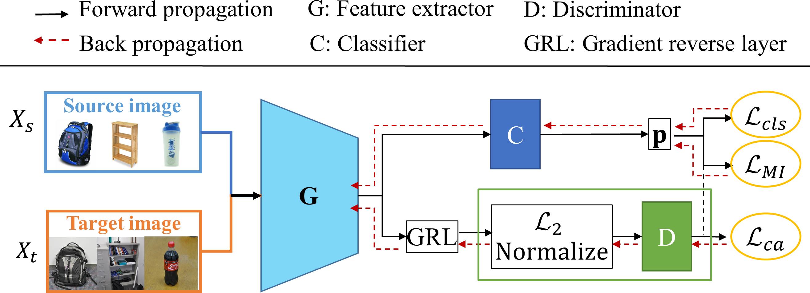

# ICME2024 - CaPAN: Class-aware Prototypical Adversarial Networks for Unsupervised Domain Adaptation


# CaPAN

This repo is the official PyTorch implementation of "CaPAN: Class-aware Prototypical Adversarial Networks for Unsupervised Domain Adaptation".

<div align=center></div>

## Abstract

Adversarial domain adaptation has achieved impressive performances for unsupervised domain adaptation (UDA). However, existing adversarial UDA methods often rely on multiple domain discriminators to capture diverse patterns, which limit their scalability and resulting in dispersed features. To address these issues, we propose a novel method called Class-aware Prototypical Adversarial Network (CaPAN), which efficiently extracts transferable and discriminative features. Specifically, our class-aware adversarial learning employs a single multi-class discriminator to capture various patterns, aligning class-level features. Furthermore, to enhance the discriminative ability of our model, we introduce a prototypical domain discriminator to enhance the discriminatively of the learned features by aligning target sample towards prototypes (centers of each class), resulting in a more compact feature space. Extensive experiments validate the effectiveness of CaPAN, which can also be integrated as a regularization technique for existing methods to further improve their performance.


## Prepare
```bash
pip install -r requirements.txt
```


## Datasets
* [DomainNet](http://ai.bu.edu/M3SDA/)
* [Office31](https://faculty.cc.gatech.edu/~judy/domainadapt/)
* [Office-Home](https://www.hemanthdv.org/officeHomeDataset.html)
* [VisDA2017](http://ai.bu.edu/visda-2017/)


## Bibtex
If you find this work useful for your research, please cite: 
```bibtex
@inproceedings{yuandwang2024icme,
  title={CaPAN: Class-aware Prototypical Adversarial Networks for Unsupervised Domain Adaptation},
  author={Zhenyu Yu, Pei Wang},
  booktitle={Proceedings of the IEEE ICME},
  pages={xx--xx},
  year={2024}
}
```


## Acknowledgment
Some codes are mainly based on following repositories. Thanks for their contributions.
* [SCDA](https://github.com/BIT-DA/SCDA.git)
* [Transfer Learning Library](https://github.com/thuml/Transfer-Learning-Library.git)

